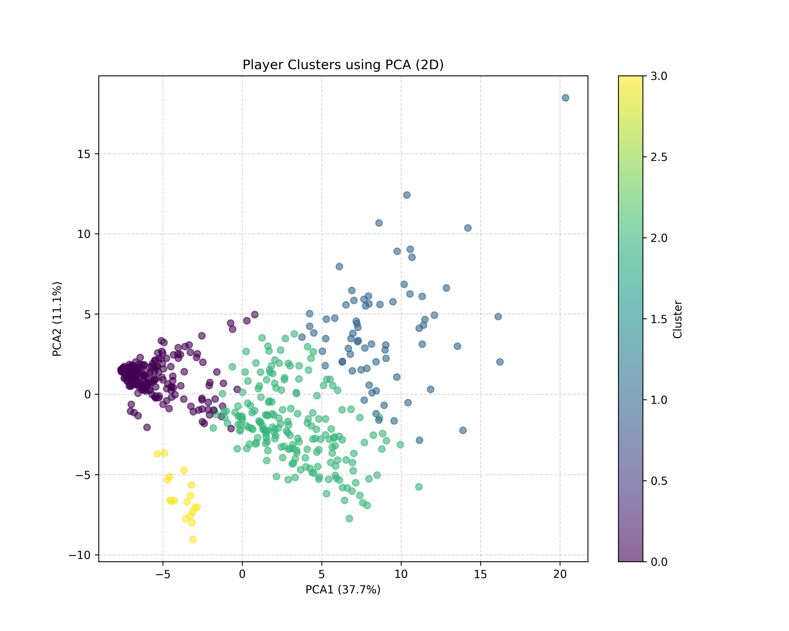

# Báo cáo Tổng kết Phân tích Dữ liệu Cầu thủ EPL 2024-2025

## Tóm tắt Dự án
Báo cáo này tóm tắt kết quả phân tích toàn diện về mùa giải Ngoại hạng Anh (EPL) 2024-2025. Chúng tôi đã phân tích các chỉ số hiệu suất của tất cả cầu thủ thi đấu trên 90 phút, phân loại cầu thủ bằng phương pháp gom cụm K-means và xây dựng mô hình dự đoán giá trị chuyển nhượng.

## 1. Thu thập Dữ liệu & Thống kê
Chúng tôi đã hợp nhất dữ liệu từ FBRef, cơ sở dữ liệu trận đấu địa phương và Transfermarkt. Bộ dữ liệu cuối cùng bao gồm hơn 100 chỉ số hiệu suất cho hơn 500 cầu thủ.

### Tóm tắt Hiệu suất Hàng đầu
- **Đội bóng thi đấu hiệu quả nhất**: Dựa trên điểm z-score tổng hợp của tất cả các chỉ số hiệu suất, **Brentford** nổi lên là đội bóng có thành tích thống kê cao vượt mức kỳ vọng.
- **Phân phối Thống kê chính**: Biểu đồ tần suất (histograms) cho tất cả các thuộc tính đã được tạo ra để hiểu rõ xu hướng chung của toàn giải đấu.

## 2. Phân tích Thống kê
Các biểu đồ phân phối chi tiết và so sánh giữa các đội bóng có sẵn trong thư mục `reports/figures/`.

### Ví dụ về Phân phối
- **Tổng số bàn thắng**: Cho thấy sự tập trung ghi bàn ở các tiền đạo hàng đầu.
- **Giá trị chuyển nhượng**: Cho thấy một phân phối lệch, nơi một vài "siêu sao" chiếm giữ phần lớn giá trị thị trường.

## 3. Gom cụm Cầu thủ (K-Means)
Sử dụng phương pháp Elbow, chúng tôi xác định rằng **k=4** là số lượng cụm tối ưu để phân loại vai trò của cầu thủ.

### Sơ đồ Cụm (PCA)
Chúng tôi đã sử dụng Phân tích Thành phần Chính (PCA) để giảm chiều dữ liệu hiệu suất xuống 2D nhằm mục đích trực quan hóa.

**Giải thích các cụm:**
- **Cụm 0**: Cầu thủ thiên về phòng ngự (Hậu vệ/Tiền vệ trụ).
- **Cụm 1**: Những người kiến thiết lối chơi sáng tạo và điều phối bóng khối lượng lớn.
- **Cụm 2**: Những cầu thủ ghi bàn chủ lực và tiền đạo nguy hiểm.
- **Cụm 3**: Cầu thủ đa năng và những người có hồ sơ thống kê cân bằng/hỗn hợp.

## 4. Dự đoán Giá trị Chuyển nhượng
Một mô hình Random Forest Regressor đã được huấn luyện trên các cầu thủ thi đấu trên 900 phút.

- **Độ chính xác của mô hình (R²)**: 0.563
- **Các yếu tố chính thúc đẩy giá trị**: Độ tuổi, xAG (Bàn thắng kỳ vọng từ kiến tạo), Khối lượng sút bóng và Chuyền bóng tịnh tiến (Progressive Passing).

## 5. Kết luận
Mùa giải EPL 2024-2025 cho thấy sự đa dạng cao về mặt thống kê. Sự kết hợp giữa gom cụm và mô hình dự đoán cho phép hiểu sâu hơn về vai trò của cầu thủ và giá trị thị trường tương ứng của họ. Mô hình đã xác định thành công cách thức mà mối đe dọa tấn công và độ tuổi chi phối định giá thị trường.

---

